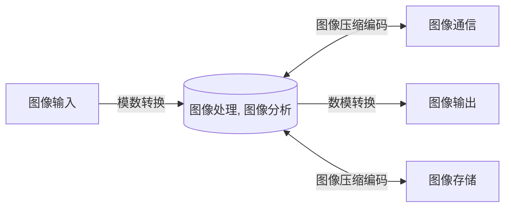
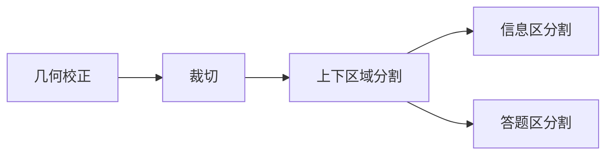
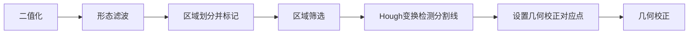

# 绪论

## 图像的基本概念

人类从外界获得的信息绝大部分都是由视觉获取的。

图像是光和大脑相结合的产物，分为可见光成像和不可见光成像（红外、紫外、X光）。

图像是二维信号，可定义为一个二维函数$f(x, y)$，当空间坐标$(x, y)$和幅值$f$为有限的离散数值时，称改图像为数字图像，$f(x, y)$是点$(x, y)$的幅值。

视频是动态图像，可定义为一个三位函数$f(x, y, t)$。其中，$t$为时间坐标，$f(x, y)$是$t$时刻上点$(x, y)$的幅值。

## 数字图像处理的基本概念

数字图像处理（Digital Image Processing）是将图像信号转换成数字信号，并利用计算机对图像使用去除/衰减噪声、增强、复原、分割、提取特征等领域的理论、方法和技术对其处理的过程。

模拟图像处理（Analog Image Processing）是将图像信号转换成模拟信号，并利用**光学设备和电学设备**对图像使用去除/衰减噪声、增强等领域的理论、方法和技术对其处理的过程。

两大任务：

1. 以人类视觉解释为目的，改善图像质量；
2. 以机器识别理解为目的，用于存储、传输和表示的图像数据处理。

灰度图像中每个元素的亮度用一个数值来表示，即白色程度，通常数值在0~255间，即0（黑）-（灰/黑白混色）-255（白）。

彩色图像中每个元素的色彩可以用红（R）绿（G）蓝（B）三个数值来表示，通常每个通道的数值也在0~255间，即0（黑）-（黑红混色）-255（红）。

左图为PS的拾色器使用HSB（类似HSV）颜色空间、固定H、S通道为0时，B通道的颜色范围。

右图为PS的拾色器使用RGB颜色空间、固定G、B通道为0时，R通道的颜色范围。

|  |  |
| ------------------------------------------------------------ | ------------------------------------------------------------ |

另外，经QQ压缩过的灰度图像和红度图像，灰度共有30个层，红度共有10个层，这说明QQ的图像压缩算法将每个像素点用30种颜色所占用的bit数（估计是6位，剩下2位可能标识是灰度还是彩度）来存储颜色信息，而彩色像素需要三个通道，所以量化数是灰度图像的1/3（应该是这样按除法算吧？）。另外应该是靠3个通道值相等来标记灰度像素。

像素：数字图像中的元素$(x, y, f)$

数字图像处理的三个层次：

1. 低级图像处理：图像->图像，对图像进行加工以改善图像的视觉效果、为中高级图像处理打基础，或进行图像压缩等。eg. 图像去雾
2. 中级图像处理：图像->数据（锚框等），对图像中感兴趣的目标进行检测、分割或测量，从而获取图像中目标的信息。eg. 目标检测、目标分割
3. 高级图像处理（狭义上的计算机视觉）：图像->理解，对图像中的目标，研究它们的性质和它们之间的相互联系，得到图像含义。eg. 自动驾驶、GPT4理解搞笑图片

数字图像处理的基本内容：略，后面的章节名

**数字图像处理系统的组成（HW1 Q1）**

一个基本的数字图像处理系统由图像输入、图像输出、图像存储、图像通信和图像处理和分析5个模块组成。

下图不包含图像通信模块

下图包含图像通信模块

# 数字图像基础

## 图像感知与获取

### 人眼的亮度适应范围

人的视觉系统有很大的亮度适应范围，但并不能同时在整个范围内工作，通过改变人眼的具体敏感度（改变瞳孔大小、明暗视觉转换）来实现亮度适应。

亮度是一种外界辐射的物理量在视觉中反应出来的**心理**物理量，感觉亮度（主观亮度）与实际亮度之间呈非线性关系。

马赫（Mach）带效应：在亮度变换边界附近的暗区和亮区，感觉存在一条更暗和更亮的条带，即马赫带。

同时对比度：人眼对某个区域感觉到的亮度受到背景的影响，背景暗时感觉区域亮，背景亮时感觉区域暗。

图像形成数学模型

$$
f(x, y) = i(x, y) \cdot r(x, y)
$$
其中，

$f(x, y)$是图像幅值分布

$i(x, y)$是入射场分布，取决于照射源性质，$0<i(x, y)<\infty$

$r(x, y)$是反射系数分布，取决于成像物体的性质，$0<r(x, y)<1$

## 图像采样和量化

图像信号的数字化：将图像的连续模拟信号转变为离散数字信号。

采样：图像空间坐标的离散化。（画格）

对空间坐标x和y离散化，即确定水平和垂直方向上的像素数

图像分辨率（Image resolution）就是采样所获得的图像的总像素的数量，由垂直像素数M列和水平像素数N行的乘积表示，即$M \times N$

如$2560 \times 1920 = 4915200$个像素，也称为500万像素分辨率。

**图像分辨率影响图像的精细程度**（其实我感觉这图有问题，可能只是缩放了一下，如果真的采样成16*16根本就看不出来是什么，只有模糊的格子）

量化：将像素内所含的明暗信息离散化后用数字来表示（填色）

最简单的量化是将像素内的信息用0（黑）和255（白）来表示，即2级灰度。这些像素组成的图像称为二值图像。

一般地，量化值为整数，量化层数取为2的$n$次幂。目前非特殊用途的图像均为8位量化，即$2^8=256$级量化，用$[0, 255]$来表示明暗信息。3位以下的量化会出现伪轮廓现象。

伪轮廓：原模拟图像没有，而量化过的图像却有的轮廓，如下图c中荷花叶颜色块的轮廓。

**量化层数影响图像的明暗丰富程度**

标记了一个差异明显的区域

单行采样和量化的例子

采样和量化过程

A 连续模拟图像

B 连续模拟图像的一行的亮度

C 对该行亮度进行采样（24列）和量化（8级量化）

D 离散数字图像的一行的亮度

**空间分辨率（Spatial resolution）**：图像空间中可分辨的最小细节

图像空间中可分辨的最小细节，一般有以下两种度量方式：

1. 单位长度上的线对数目，如每毫米80线对，记作80 lp/mm(Line Pairs per MilliMeter)
2. 单位长度上的**独立**像素数目，如每英寸42像素，记作42 ppi(Pixels Per Inch)

空间分辨率与图像分辨率$M\times N$成正比，若把整幅图像视为一个单位，则图像分辨率与空间分辨率在数值上相等。

空间分辨率对图像视觉效果的影响：

第一行从左到右，第一幅图是512*512分辨率的图像，右边的每幅图像都是对左侧图像每隔一行删除一行、每隔一列删除一列，即空间分辨率减半的结果。

第二行从左到右为将第一行的图像通过图像放大采样变回512*512分辨率的结果。

可以看出，**随着空间分辨率的降低，图像的精细度在逐渐损失，棋盘格状的粗颗粒像素点**（图示实际上为多个像素点）**变得越来越明显**。即图像的空间分辨率越低，图像的视觉效果越差。

参考：https://www.tutorialspoint.com/dip/spatial_resolution.htm

**灰度级分辨率（Gray level resolution）**：灰度级别中可分辨的最小变化，一般有以下两种度量方式：

1. 灰度级的数目
2. 每像素位数（Bits Per Pixel, BPP）

这两个其实是对应的，灰度级的数目 = 2 ^ 每像素位数，即量化层数与量化位数的关系。

灰度级分辨率对图像视觉效果的影响：

从左到右，第一份图是灰度级分辨率为256的图像，右边的每幅图像都是对左侧图像灰度级分辨率减半的结果。

可以看出，**随着空间分辨率的降低，图像的明暗丰富程度在逐渐损失，伪轮廓信息在逐渐增加**。即图像的空间分辨率越低，图像的视觉效果越差。

参考：https://www.tutorialspoint.com/dip/gray_level_resolution.htm

由以上得到采样和量化的原则：当限定数字图像的空间尺寸时，为了得到质量较好的图像，

- 对于**缓变**的图像，粗采样、**细量化**，以避免伪轮廓（粗量化导致荷花叶颜色分块）
- 对于**细节丰富**的图像，**细采样**、粗量化，以避免模糊（粗采样导致青蛙的眼睛被采样成眼皮）

## 图像间的一些基本关系

### 邻域

中心像素的邻点（相邻的像素点）的集合

#### 4邻域

坐标为$(x, y)$的像素P，其水平和垂直方向上的4个邻点，即坐标为$(x-1, y),(x+1, y),(x, y-1),(x, y+1)$的像素点构成的集合，称为P的4邻域，记作$N_4(p)$。

#### 对角邻域（D邻域）

坐标为$(x, y)$的像素P，其两对角线方向上的4个邻点，即坐标为$(x-1, y-1),(x-1, y+1),(x+1, y-1),(x+1, y+1)$的像素点构成的集合，称为P的对角邻域，记作$N_D(p)$。

#### 8邻域

坐标为$(x, y)$的像素P，其水平方向、垂直方向、两对角线方向上的8个邻点，即坐标为$(x-1, y),(x+1, y),(x, y-1),(x, y+1), (x-1, y-1),(x-1, y+1),(x+1, y-1),(x+1, y+1)$的像素点构成的集合，称为P的8邻域，记作$N_8(p)$。

显然地，有
$$
N_8(p)=N_4(p)+N_D(p)
$$

### 邻接

令V为具有特定相似性准则的灰度值集合，$V=\left\lbrace v_1,v_2, \cdots\right\rbrace$。

若$p\in V$且$q\in V$，则称$p$、$q$的灰度值相近。

若$q$还在$p$的某个邻域中，则称$p$与$q$在这个邻域上邻接。

#### 4邻接

如果$p\in V, q\in V$且$q\in N_4(p)$，那么称$p$与$q$是4邻接的。

#### 8邻接

如果$p\in V, q\in V$且$q\in N_8(p)$，那么称$p$与$q$是8邻接的。

注. 前面那个条件是幅值在集合内，后面那个条件是空间坐标在集合内。图中的黄色部分代表0，红色代表1。

#### m邻接

如果$p\in V, q\in V$，且

1. $q\in N_4(p)$
2. $q\in N_D(p)$，且对$\forall r \in N_4(p)\cap N_4(q)$有$r\notin V$

二者满足其一，则称$p$与$q$是m邻接的。

自然语言表述：

如果$p$和$q$的值都在V内，且“$q$在$p$的4邻域内”或“$q$在$p$的对角邻域内，且它俩的4邻域交集中的像素点不属于$V$”，那么$p$与$q$m邻接。

即必须只能通过1次4通路或1次8通路到达，而不能通过2次4通路到达的两像素为m邻接的。

### 连通

起点是坐标为$(x_0, y_0)$的像素点$p$，终点是坐标为$(x_n, y_n)$的像素点$q$的像素序列$(x_0, y_0), (x_1, y_1), \cdots, (x_n, y_n)$中，若像素点$(x_i, y_i)$和像素点$(x_{i-1}, y_{i-1})$是邻接的，则称$p$和$q$是连通的。

#### 4连通

每对像素点$(x_i, y_i)$和像素点$(x_{i-1}, y_{i-1})$都仅可以视为是4邻接的，则称$p$和$q$是4连通的，称$(x_0, y_0), (x_1, y_1), \cdots, (x_n, y_n)$为4通路。

#### 8连通

每对像素点$(x_i, y_i)$和像素点$(x_{i-1}, y_{i-1})$都仅可以视为是8邻接的，则称$p$和$q$是8连通的，称$(x_0, y_0), (x_1, y_1), \cdots, (x_n, y_n)$为8通路。

圈出的**三个点**（画错了）是4邻接的，而非m邻接的；且图中具有8邻接；且4邻接可以被视为8邻接，所以$p$和$q$是8连通的。

#### m连通

每对像素点$(x_i, y_i)$和像素点$(x_{i-1}, y_{i-1})$都可以视为是m邻接的，则称$p$和$q$是m连通的，称$(x_0, y_0), (x_1, y_1), \cdots, (x_n, y_n)$为m通路。

圈出的**三个点**（画错了）不再是4邻接，而是。。。

起点是坐标为$(x_0, y_0)$的像素点$p$，终点是坐标为$(x_n, y_n)$的像素点$q$的像素序列$(x_0, y_0), (x_1, y_1), \cdots, (x_n, y_n)$中，若像素点$(x_i, y_i)$和像素点$(x_{i-1}, y_{i-1})$是邻接的，则称$p$和$q$是连通的，称$(x_0, y_0), (x_1, y_1), \cdots, (x_n, y_n)$是一条通路。

每对像素点$(x_i, y_i)$和像素点$(x_{i-1}, y_{i-1})$都仅可以视为是4邻接的，则称$p$和$q$是4连通的，称$(x_0, y_0), (x_1, y_1), \cdots, (x_n, y_n)$为4通路。

每对像素点$(x_i, y_i)$和像素点$(x_{i-1}, y_{i-1})$都仅可以视为是8邻接的，则称$p$和$q$是8连通的，称$(x_0, y_0), (x_1, y_1), \cdots, (x_n, y_n)$为8通路。

称对8通路去除第二类m邻接所得到的通路为m通路。

（这里有问题，回来再补）

例HW2  Q4

### 距离

#### 距离度量函数

给定三个像素p、q、r，如果函数D满足以下条件，则可以作为距离度量函数

1. 非负性：$D(p, q) \geq 0$，当且仅当$p=q$时，$D(p, q) = 0$
2. 交换性：$D(p, q)=D(q, p)$
3. 三角不等式：$D(p, z)\leq D(p, q) + D(q, r)$

下面介绍几种$\R^2$空间内的距离度量函数

#### 欧几里得（Euclidean）距离

$$
D_e(p, q) = \sqrt{\left(x-s\right)^2 + \left(y-t\right)^2}
$$

即
$$
D_e(p, q) =\left[\left|x-s\right|^2 + \left|y-t\right|^2\right]^\frac{1}{2}
$$
到达另一点的直线距离

#### 曼哈顿（Manhattan）距离 / 城区距离 / $D_4$距离

$$
D_4(p, q) =|x-s| + |y-t|
$$

到达另一点的折线距离

#### 切比雪夫（Chebyshev）距离 / 棋盘距离 / $D_8$距离

$$
D_8(p, q) = \max(|x-s|, |y-t|)
$$

到达另一点所在行/列（某一维度）的直线距离

#### 明考夫斯基（Minkowski）距离

$$
D(p, q) =\left(\left|x-s\right|^r + \left|y-t\right|^r\right)^\frac{1}{r}
$$

当$r=1$时，明考夫斯基距离就是曼哈顿距离

当$r=2$时，明考夫斯基距离就是欧几里得距离

当$r \rightarrow \infty$时，明考夫斯基距离就是切比雪夫距离

计算$\R^n$空间中的明考夫斯基距离的极限，可以得到
$$
\lim _{r \rightarrow \infty}\left(\sum_{i=1}^n\left|x_i-y_i\right|^r\right)^{\frac{1}{r}}=\max _{i=1}^n\left|x_i-y_i\right|
$$
令$n=2$，即有
$$
\lim _{r \rightarrow \infty}\left(\left|x-s\right|^r + \left|y-t\right|^r\right)^{\frac{1}{r}}=\max(|x-s|, |y-t|)
$$
以下是ChatGPT给出的计算步骤，要将上述的$r$换为$p$

> 这个式子可以通过求极限得到。我们先将明考夫斯基距离的定义公式写出来：
>
> $$
> D_p(x,y) = \left(\sum_{i=1}^n |x_i - y_i|^p\right)^{1/p}
> $$
> 当 $p$ 趋近于无穷大时，我们将 $q = 1/p$，则 $q$ 趋近于 0。此时，我们可以使用泰勒级数展开式，将 $|x_i - y_i|^q$ 展开成它的一阶泰勒多项式和剩余项：
>
> $$
> |x_i - y_i|^q = 1 + q(x_i - y_i) + O(q^2)
> $$
> 将其代入 $D_p(x,y)$ 的定义中，得到：
> $$
> \begin{aligned}
> D_p(x,y) &= \left(\sum_{i=1}^n |x_i - y_i|^p\right)^{1/p} \\
> &= \left(\sum_{i=1}^n (|x_i - y_i|^q)^{1/q}\right)^{1/p} \\
> &\approx \left(\sum_{i=1}^n (1 + q(x_i - y_i) + O(q^2))\right)^{1/p} \\
> &= \left(\sum_{i=1}^n 1 + q\sum_{i=1}^n (x_i - y_i) + O(q^2)\right)^{1/p} \\
> &= \left(n + q\sum_{i=1}^n (x_i - y_i) + O(q^2)\right)^{1/p} \\
> \end{aligned}
> $$
> 当 $p$ 趋近于无穷大时，$D_p(x,y)$ 趋近于：
>
> $$
> \lim_{p \to \infty} D_p(x,y) = \left(\max_{i=1}^n |x_i - y_i|^q\right)^\frac{1}{p}
> $$
> 将 $q=1/p$ 带入上式，得到：
>
> $$
> \lim_{p \to \infty} D_p(x,y) = \lim_{q \to 0} \left(\max_{i=1}^n |x_i - y_i|^q\right)^{q} = D_{\infty}(x,y)
> $$
> 因此，当 $p$ 趋近于无穷大时，明考夫斯基距离 $D_p(x,y)$ 会趋近于切比雪夫距离 $D_{\infty}(x,y)$。

# 图像基本运算

## 图像几何变换

对图像进行大小、形状、位置等方面的变换即图像的几何变换。

图像的几何变换是一种空间变换，关键在于确定点与点之间的映射关系。

### 几何变换基础

#### 齐次坐标

齐次坐标表示法：用$n+1$维向量表示$n$维向量的方法。

例如对于某一点，将$(x, y)$表示为$(x, y, 1)^T$，也就是$3\times1$向量

$$
\begin{pmatrix}
x\\ 
y\\ 
1
\end{pmatrix}
$$

将齐次坐标与变换矩阵$T$相乘，即可得到新的齐次坐标，从中可以提取新的坐标。
$$
\left(\begin{array}{c}
x^{\prime} \\
y^{\prime} \\
1
\end{array}\right)=\left(\begin{array}{lll}
a & b & k \\
c & d & m \\
p & q & s
\end{array}\right)\left(\begin{array}{l}
x \\
y \\
1
\end{array}\right)
$$
变换矩阵$T$中各参数的意义：

事实上，变换后的坐标的第n维度不一定为1，所以需要通过除以$px+qy+s$来使变换后的坐标成为齐次坐标，这个步骤称为透视除法（Perspective Division）或去齐次化（Dehomogenizing）

不同组的参数一般不会全为有意义值，比如全比例变换参数$s$，如果单独出现作为分母的话更好理解它的意义。

参考：[Robust Hand Pose Recognition from Stereoscopic Capture (city.ac.uk)](https://openaccess.city.ac.uk/id/eprint/19938/1/Basaru%2C Rilwan Remilekun.pdf)  P40 公式3.6

在二维图像中，可用点集来运算，即$3\times n$矩阵。

#### 插值运算

几何变换后，对于变换图像上的整数像素点，通过**逆变换**可以确定它在原图像上的对应点（插值点）的坐标，若这个坐标是整数，则直接赋对应点的幅值；若不是整数，则要由插值算法，在**原图像上**计算出应赋何值。事实上，这种通过逆变换，在原图像上进行计算非整数像素点的方法也被称为后向映射法，在下一节介绍。

在下面的例子中，$(x+a, y+b)$是由变换图像上某点计算出的，在原图像上的坐标，$x$、$y$为非负整数，$0 \leq a, b \leq 1$。

##### 最近邻插值

原图像上非整数像素点的灰度值**等于**原图像上距离最近的整数像素点的灰度值。

例如，在这张图中，
$$
f(x+a, y+b) = f(x, y)
$$
当图像中临近像素的灰度级有较大变化时，该算法产生的变换图像细节比较粗糙。

##### 双线性插值

原图像上非整数像素点的灰度值由原图像上距离最近的四个整数像素点的灰度值，**通过双线性算法**确定。

例如，在这张图中，
$$
\begin{aligned}
f(x, y+b)&=f(x, y)+b \cdot \frac{f(x, y+1)-f(x, y)}{(y+1)-y}\\
&=f(x, y)+b[f(x, y+1)-f(x, y)]
\end{aligned}
$$

$$
\begin{aligned}
f(x+1, y+b)&=f(x+1, y)+b\cdot\frac{f(x+1, y+1)-f(x+1, y)}{(y+1)-y}\\
&=f(x+1, y)+b[f(x+1, y+1)-f(x+1, y)]
\end{aligned}
$$

$$
\begin{aligned}
f(x+a, y+b)&=f(x, y+b)+a\cdot\frac{f(x+1, y+b)-f(x, y+b)}{(x+1)-x}\\
&=f(x, y+b)+a[f(x+1, y+b)-f(x, y+b)]
\end{aligned}
$$

计算过程很简单，算法如其名，要进行两次线性方程的计算：

1. 计算两条线性方程（实际上只需要算一下斜率然后用三角关系）
2. 代入坐标得到$f(x, y+b)$和$f(x+1, y+b)$
3. 计算一条线性方程
4. 代入坐标得到$f(x+a, y+b)$

该算法具有防锯齿效果，变换图像拥有较平滑的边缘。

##### 双三次插值

略

#### 几何变换方法

图像的几何变换可以通过前向映射法和后向映射法确定原图像与变换图像中点与点的映射关系。

因为原图像上的大多数像素点无法映射到整数像素点，在变换图像上计算整数像素点的前向映射法会丢失过多像素，所以一般采用后向映射法。

前面提到，后向映射法是一种通过逆变换，在原图像上进行计算非整数像素点的方法。

具体来说，其步骤如下：

1. 根据几何变换公式$T$计算新图像的**尺寸**
2. 根据几何变换的逆变换$T^{-1}$，确定变换图像中的每一个像素点在原图像中的对应像素点
3. 按映射关系给变换图像中的各个像素点赋值：
   - 若原图像中的对应点超出原图像的宽高范围，将背景色赋值给变换图像中的点；
   - 若原图像中的对应点存在（整数坐标点），将其值赋值给变换图像中的点；
   - 若原图像中的对应点不存在（非整数坐标点），采用插值运算计算该点的值，将其赋值给变换图像中的点。

### 图像位置变换

图像的位置变换：图像的大小和形状不发生变换，只是像素点的位置发生变换。含旋转、平移、镜像变换。

#### 图像的平移

设图像的大小为 $M \times N$, 采用像素坐标系，像素点 $(x, y)$ 进行平移后, 得到像素点 $\left(x^{\prime}, y^{\prime}\right)$，其中 $x$ 轴方向的平移量为 $\Delta x$，$y$ 轴方向的平移量为 $\Delta y$。

那么，平移变换公式为
$$
\left\{\begin{array}{l}
x^{\prime}=x+\Delta x \\
y^{\prime}=y+\Delta y
\end{array}\right.
$$
其矩阵形式为
$$
\left(\begin{array}{l}
x^{\prime} \\
y^{\prime} \\
1
\end{array}\right)=\left(\begin{array}{ccc}
1 & 0 & \Delta x \\
0 & 1 & \Delta y \\
0 & 0 & 1
\end{array}\right)\left(\begin{array}{l}
x \\
y \\
1
\end{array}\right)
$$
对平移变换求逆, 有
$$
\left\{\begin{array}{l}
x=x^{\prime}-\Delta x \\
y=y^{\prime}-\Delta y
\end{array}
\right.
$$
其矩阵形式为
$$
\left(\begin{array}{l}
x \\
y \\
1
\end{array}\right)=\left(\begin{array}{ccc}
1 & 0 & -\Delta x \\
0 & 1 & -\Delta y \\
0 & 0 & 1
\end{array}\right)\left(\begin{array}{l}
x^{\prime} \\
y^{\prime} \\
1
\end{array}\right)
$$
图像经过平移处理后会超出原图像的宽高范围（PS里叫画布），如果不想丢失被移除的部分图像，可将可视区域（画布）的宽度扩大$|\Delta x|$，高度扩大$|\Delta y|$。

#### 图像的镜像

设图像的大小为 $M \times N$, 采用像素坐标系。

那么，镜像变换公式为

水平镜像：
$$
\left\{\begin{array}{l}
x^{\prime}=-x+M-1 \\
y^{\prime}=y
\end{array}\right.
$$
垂直镜像：
$$
\left\{\begin{array}{l}
x^{\prime}=x \\
y^{\prime}=-y+N-1
\end{array}\right.
$$
对角镜像：
$$
\left\{\begin{array}{l}
x^{\prime}=-x+M-1 \\
y^{\prime}=-y+N-1
\end{array}\right.
$$
其矩阵形式为

水平镜像：
$$
\left(\begin{array}{l}
x^{\prime} \\
y^{\prime} \\
1
\end{array}\right)=\left(\begin{array}{ccc}
-1 & 0 & M-1 \\
0 & 1 & 0 \\
0 & 0 & 1
\end{array}\right)\left(\begin{array}{l}
x \\
y \\
1
\end{array}\right)
$$
垂直镜像：
$$
\left(\begin{array}{l}
x^{\prime} \\
y^{\prime} \\
1
\end{array}\right)=\left(\begin{array}{ccc}
1 & 0 & 0 \\
0 & -1 & N-1 \\
0 & 0 & 1
\end{array}\right)\left(\begin{array}{l}
x \\
y \\
1
\end{array}\right)
$$
对角镜像：
$$
\left(\begin{array}{c}
x^{\prime} \\
y^{\prime} \\
1
\end{array}\right)=\left(\begin{array}{ccc}
-1 & 0 & M-1 \\
0 & -1 & N-1 \\
0 & 0 & 1
\end{array}\right)\left(\begin{array}{l}
x \\
y \\
1
\end{array}\right)
$$
可以看出，**镜像变换就是先对称变换，然后平移变换回画布内**。

对镜像变换求逆, 有

水平变换：
$$
\left\{\begin{array}{l}
x=-x^{\prime}+M-1 \\
y=y^{\prime}
\end{array}\right.
$$
其他镜像变换及其矩阵表示类似，略。

#### 图像的旋转

图像的旋转：以图像某一点为原点，以逆时针/顺时针方向将图像上的所有像素点旋转一个相同的角度。

设图像的大小为 $M \times N$, 采用**极坐标系**。

绕任意点旋转与绕坐标系原点旋转类似，首先介绍绕坐标系原点$(0, 0)$旋转。

设点$(x, y)$在极坐标系下为$(r, \alpha)$，要旋转的$\Delta \alpha = -\theta$，即

那么，有
$$
\left\{\begin{array}{l}
x=r \cdot \cos \alpha \\
y=r \cdot \sin \alpha
\end{array}\right.\\
$$
**旋转变换公式**为（使用二角和差公式展开，移出$\cos$要变号）
$$
\left\{\begin{array}{l}
x^{\prime}=r \cdot \cos (\alpha-\theta)=r \cos \alpha \cdot \cos \theta+r \sin \alpha \cdot \sin \theta=x \cdot \cos \theta+y \cdot \sin \theta \\
y^{\prime}=r \cdot \sin (\alpha-\theta)=r \sin \alpha \cdot \cos \theta-r \cos \alpha \cdot \sin \theta=-x \cdot \sin \theta+y \cdot \cos \theta
\end{array}\right. \\
$$
其矩阵形式为
$$
\begin{aligned}
\left(\begin{array}{l}
x^{\prime} \\
y^{\prime} \\
1
\end{array}\right)=\left(\begin{array}{ccc}
\cos \theta & \sin \theta & 0 \\
-\sin \theta & \cos \theta & 0 \\
0 & 0 & 1
\end{array}\right)\left(\begin{array}{l}
x \\
y \\
1
\end{array}\right) \\
&
\end{aligned}\\
$$
对旋转变换求逆, 有
$$
\left\{\begin{array}{l}
x=r^{\prime} \cdot \cos (\theta+\alpha)=r^{\prime} \cos \alpha \cdot \cos \theta-r^{\prime} \sin \alpha \cdot \sin \theta=x^{\prime} \cdot \cos \theta-y^{\prime} \cdot \sin \theta \\
y=r^{\prime} \cdot \sin (\theta+\alpha)=r^{\prime} \sin \alpha \cdot \cos \theta+r^{\prime} \cos \alpha \cdot \sin \theta=x^{\prime} \cdot \sin \theta+y^{\prime} \cdot \cos \theta
\end{array}\right. \\
$$
对于整幅图像，其**图像旋转变换过程**如下：

1. 确定旋转后新图像角像素点及行列数

   由示意图，有原图像四个角像素点在原坐标系中的坐标：
   $$
   \begin{aligned}
   & \left(x_1, y_1\right)=(0,0) \quad &\left(x_2, y_2\right)=(M-1,0) \\
   & \left(x_3, y_3\right)=(M-1, N-1) \quad &\left(x_4, y_4\right)=(0, N-1) \\
   \end{aligned}
   $$
   将四个角像素点代入逆时针旋转公式，得到新图像的四个角像素点**在原坐标系中**的坐标：
   $$
   \begin{array}{l}
   \left(x_1^{\prime}, y_1^{\prime}\right)=(0,0) \\
   \left(x_2^{\prime}, y_2^{\prime}\right)=((M-1) \cos \theta,-(M-1) \sin \theta) \\
   \left(x_3^{\prime}, y_3^{\prime}\right)=((M-1) \cos \theta+(N-1) \sin \theta,-(M-1) \sin \theta+(N-1) \cos \theta) \\
   \left(x_4^{\prime}, y_4^{\prime}\right)=((N-1) \sin \theta,(N-1) \cos \theta)
   \end{array}
   $$
   取
   $$
   \min x^{\prime} = \min\lbrace x_1^{\prime}, x_2^{\prime}, x_3^{\prime}, x_4^{\prime}\rbrace \\ 
   \max x^{\prime} = \max\lbrace x_1^{\prime}, x_2^{\prime}, x_3^{\prime}, x_4^{\prime}\rbrace
   $$

   $$
   \min y^{\prime} = \min\lbrace y_1^{\prime}, y_2^{\prime}, y_3^{\prime}, y_4^{\prime}\rbrace \\
   \max y^{\prime} = \max\lbrace y_1^{\prime}, y_2^{\prime}, y_3^{\prime}, y_4^{\prime}\rbrace
   $$

   那么有新图像的列数$M^{\prime}$和行数$N^{\prime}$
   $$
   M^{\prime} = \max x^{\prime} - \min x^{\prime} + 1 \\
   N^{\prime} = \max y^{\prime} - \min y^{\prime} + 1
   $$

2. 生成新图像坐标

   **只有这里需要根据新坐标系坐标确定原坐标系坐标。**

   根据新图像**在新坐标系下的**像素点$(x^{\prime\prime}, y^{\prime\prime})$，其中$x^{\prime\prime} \in \left[0, M^{\prime}-1\right], y^{\prime\prime} \in \left[0, N^{\prime}-1\right]$，生成**在原坐标系下的**坐标$(x^{\prime}, y^{\prime})$
   $$
   x^{\prime} = \min x^{\prime} + x^{\prime\prime} \\ 
   y^{\prime} = \min y^{\prime} + y^{\prime\prime}
   $$

3. 旋转逆变换为对应点

   对于新图像在原坐标系下的每个坐标$(x^{\prime}, y^{\prime})$，代入旋转变换的逆变换公式，得到新图像在原坐标系下，在原图像内的（宽高内）或附近的（宽高外）对应点。

4. 根据对应点为新图像像素点赋值

   根据对应点超出原图像宽高、整数坐标像素点、非整数坐标像素点三类情况进行直接赋值或插值赋值。

对于将其他点作为原点旋转，如中心点，只需要将坐标系平移到中心点（反过来看，即将$(x, y)$平移），此时原点坐标仍为$(0, 0)$，按照上述原点旋转过程旋转，最后再将坐标系平移回去即可。

（其实就是把坐标系想象成扳手，把图像想象成螺丝。把坐标系拿过去将图像转完之后，再将坐标系放回原处；或者说把图像放到扳手上转完之后，再把图像放回原处）

注. 将图像平移回去要放在第3步和第4步之间，因为已知的原图像的坐标是按照原坐标系原点计算的。

例3.3

### 图像形状变换

图像的形状变换：图像的大小和形状发生变换，含放大、缩小、错切变换。

#### 图像的缩放

图像的缩放：将给定图像的尺寸在$x$、$y$方向分别缩放$k_x$、$k_y$倍。

若$k_x=k_y$，则称为图像的按比例缩放。

若$k_x\neq k_y$，缩放会产生几何畸变，则称为图像的不按比例缩放。

缩放后，新图像的分辨率为$k_x M\times k_y N$。

缩放变换公式为
$$
\left\{\begin{array}{l}
x^{\prime}=k_x\cdot x\\
y^{\prime}=k_y\cdot y
\end{array}\right. \\
$$
其矩阵形式为
$$
\begin{aligned}
\left(\begin{array}{l}
x^{\prime} \\
y^{\prime} \\
1
\end{array}\right)=\left(\begin{array}{ccc}
k_x & 0 & 0 \\
0 & k_y & 0 \\
0 & 0 & 1
\end{array}\right)\left(\begin{array}{l}
x \\
y \\
1
\end{array}\right) \\
&
\end{aligned}\\
$$
对缩放变换求逆，其矩阵形式为
$$
\begin{aligned}
\left(\begin{array}{l}
x \\
y \\
1
\end{array}\right)=\left(\begin{array}{ccc}
\frac{1}{k_x} & 0 & 0 \\
0 & \frac{1}{k_y} & 0 \\
0 & 0 & 1
\end{array}\right)\left(\begin{array}{l}
x^{\prime} \\
y^{\prime} \\
1
\end{array}\right) \\
&
\end{aligned}\\
$$

例3.5

从结果上看，缩放后的新图像去除了原图像的两行一列，所以缩小图像会造成图像的信息丢失。

#### 图像的错切

图像的错切：平面景物在投影平面上的非垂直投影

听着很高级，其实就是PS里的斜切。

错切变换公式为

在水平方向上（行坐标y不变）
$$
\left\{\begin{array}{l}
x^{\prime}=x + d_x y \\
y^{\prime}=y
\end{array}\right. \\
$$
在垂直方向上（列坐标x不变）
$$
\left\{\begin{array}{l}
x^{\prime}=x\\
y^{\prime}=y + d_y x
\end{array}\right. \\
$$
在水平方向和垂直方向上
$$
\left\{\begin{array}{l}
x^{\prime}=x + d_x y \\
y^{\prime}=y + d_y x
\end{array}\right. \\
$$
当错切只在某一方向上产生时，其他方向的$d = 0$

示意图

实例

## 图像代数运算

图像的代数运算：对多幅输入图像进行点对点（pixel-wise）的算术运算（加减乘除）或逻辑运算（与或非）。

### 算术运算

#### 加法运算

$$
g(x, y) = f_1(x, y) + f_2(x, y)
$$

其中，$f_1$和$f_2$是同等尺寸的两幅图像。

加法运算中像素值的和可能会超出灰度值表达范围，可以用以下方法进行和值处理：

1. 截断处理
   $$
   g(x, y)=\left\{\begin{array}{l}
   255  &,g(x, y)>255   \\
   g(x, y) &,otherwise
   \end{array}\right. \\
   $$

2. 加权求和
   $$
   g(x, y) = \alpha_1f_1(x, y) + \alpha_2f_2(x, y) \quad ,\sum_i\alpha_i=1 
   $$

**加法运算的应用**：

1. 去除叠加性噪声
2. 改善图像视觉效果
3. **加宽波段**
4. 图像合成、拼接

#### 减法运算

$$
g(x, y) = f_1(x, y) - f_2(x, y)
$$

减法运算中像素值的差可能会超出灰度值表达范围，可以用以下方法进行差值处理：

1. 截断处理
   $$
   g(x, y)=\left\{\begin{array}{l}
   0  &,g(x, y)<0   \\
   g(x, y) &,otherwise
   \end{array}\right. \\
   $$

2. 取绝对值（感觉这种不靠谱，应该减暗的部分反而会变亮？）
   $$
   g(x, y) = |g(x, y)|
   $$

**减法运算的应用**：

1. 显示两幅图像的差异。eg. 两帧图像的变化

   这个图虽然很形象但有问题吧？左边的条应该是绿色-粉色剩下的颜色，右边的条应该是粉色减绿色剩下的颜色。

   

2. 去除不需要的叠加性图案。eg. 高斯噪声

3. 图像分割。eg. 去除车辆的背景

4. 图像合成

#### 乘法运算

$$
g(x, y) = f_1(x, y) \times f_2(x, y)
$$

**乘法运算的应用**

1. 图像的局部显示和提取。eg. 用二值模板图像与原图像相乘

   

   

2. 图像合成

#### 除法运算

$$
\begin{array}{l}
g(x, y) &= f_1(x, y) \div f_2(x, y)\\
&= f_1(x, y) \times \overline{f_2(x, y)} \qquad , \overline{f_2(x, y)}=255-f_2(x, y)
\end{array}
$$

**除法运算的主要应用**：

1. 消除空间可变的量化敏感函数

2. 归一化 eg. 除以255模板

3. 产生比率图像 eg. 检测两幅图像间的差别

   

### 逻辑运算

#### 非运算

$$
g(x, y) = \overline{f(x, y)} = 255 -  f(x, y)
$$

用于画的原图像的补图像/阴图像

#### 与运算

$$
g(x, y) = f_1(x, y) \& f_2(x, y)
$$

求两幅图像的相交子图，可作为模板运算。（类似使用二值模板的乘法运算）

#### 或运算

$$
g(x, y) = f_1(x, y) | f_2(x, y)
$$

合并两幅图像（有短路现象），可作为模板运算。

# 图像正交变换

## 离散傅里叶变换

离散傅里叶变换（Discrete Fourier Transform, DFT）是直接处理离散时间信号（从时间域转换到频率域）的傅里叶变换，在数字信号处理中应用广泛。

注. 如何理解傅里叶变换呢？冈萨雷斯认为棱镜可以将可见光转化为光谱，傅里叶变换就是数学领域的“棱镜”，将信号转化为频谱。

### 一维离散傅里叶变换

对于有限长数字序列$f(x), x=0,1, \cdots N-1$，

一维DFT，即$f(x) \rightarrow F(u)$公式为
$$
F(u)=\sum_{x=0}^{N-1} f(x) e^{-j \frac{2 \pi}{N}ux} \quad u=0,1,2, \cdots, N-1
$$
里面那坨代表模长为u的旋转因子在复平面中逆时针旋转了x次

一维IDFT，即$F(u) \rightarrow f(x)$公式为
$$
f(x)=\frac{1}{N} \sum_{u=0}^{N-1} F(u) e^{j \frac{2 \pi}{N}ux} \quad x=0,1,2, \cdots, N-1
$$
注. IDFT要除以$N$，这个类似微分，要除以对应采样数。

称$f(x)$和$F(u)$为离散傅里叶变换对，表示为$\mathscr{F}[f(x)]=F(u)$或$f(x) \Leftrightarrow F(u)$

令$W=e^{-j \frac{2 \pi}{N}}$，即**模长为1的旋转因子**，有
$$
\left\{\begin{array}{l}
F(u)=\sum_{x=0}^{N-1} f(x) W^{ux} \qquad &u=0,1,2, \cdots, N-1 \\
f(x)=\frac{1}{N} \sum_{u=0}^{N-1} F(u) W^{-ux} \qquad &x=0,1,2, \cdots, N-1
\end{array}
\right.
$$
当计算时，我们可以使用欧拉公式（Euler's formula）计算e的复数次幂

由
$$
e^{ix} = \cos x +i\sin x
$$
有

| $x$      | $0$  | $\frac{\pi}{2}$ | $\pi$ | $\frac{3\pi}{2}$ |
| -------- | ---- | --------------- | ----- | ---------------- |
| $e^{ix}$ | $1$  | $i$             | $-1$  | $-i$             |

注. 在数学领域，通常用$i$表示虚数单位。在信号领域，通常用$j$表示虚数单位，二者意义相同。

### 一维快速傅里叶变换

#### 周期性和对称性

由于复平面上的旋转有周期性和对称性，所以可以对一维DFT进行改进得到一维FFT。

具体来说
$$
\left\{\begin{array}{l}
W^{u \pm r N}=\mathrm{e}^{-\mathrm{j} \frac{2 \pi}{N}(u \pm r N)}=\mathrm{e}^{-\mathrm{j} \frac{2 \pi}{N} u} \times \mathrm{e}^{\mp j 2 \pi r}=\mathrm{e}^{-\mathrm{j} \frac{2 \pi}{N} u}=W^u \\
W^{u \pm \frac{N}{2}}=\mathrm{e}^{-\mathrm{j} \frac{2 \pi}{N}\left(u \pm \frac{N}{2}\right)}=\mathrm{e}^{-\mathrm{j} \frac{2 \pi}{N} u} \times \mathrm{e}^{\mp \mathrm{j} \pi}=-\mathrm{e}^{-\mathrm{j} \frac{2 \pi}{N} u}=-W^u
\end{array}\right.
$$
意思就是

$x$每加$N$，代表在复平面上旋转$2\pi$，就等于没旋转，就等同于没加$N$。

$x$每加$\frac{N}{2}$，代表在复平面上旋转$\pi$，就等于沿原点对称，就等同于加负号。

#### 奇偶性

采样数N和旋转次数k可以同时除以2
$$
W_ {2N}^ {k}  =  e^ {-j\frac {2\pi }{2N}k}     =  e^ {-j\frac {2\pi }{N}\cdot   \frac {k}{2}} =  W_{N}^ {k/2}
$$
得到
$$
\begin{array}{l}
F(u)&=\sum_{x=0}^{N-1} f(x) e^{-j\frac{ 2 \pi }{N}u x}\\
&=\sum_{x=0}^{N-1} f(x) W_N^{u x} \\
&=\sum_{x=0}^{N / 2-1} f(2 x) W_N^{2 u x}+\sum_{x=0}^{N / 2-1} f(2 x+1) W_N^{u(2 x+1)} \\
&\xlongequal{M=:\frac{N}{2}}\sum_{x=0}^{M-1} f(2 x) W_M^{u x}+\sum_{x=0}^{M-1} f(2 x+1) W_M^{u x} W_N^u \\
&= F_e(u)+W_N^u F_o(u)\qquad, 0 \leq u \leq M \\
\end{array}
$$
使用对称性，加半周期乘负号
$$
\begin{aligned}
F(u+M)&=F_e(u+M)+W_N^{u+M} F_o(u+M) \\
& =F_e(u)+W_N^{u+M} F_o(u) \\
&\xlongequal{M=:\frac{N}{2}}F_e(u)-W_N^u F_o(u) \\
\end{aligned}
$$
该公式意思是：

频域信号=该频域信号的奇数部分 + 全采样数$W$旋转$u$次 * 该频域信号的偶数部分

这样就可以递归计算全采样数的频域信号了

例4.2

递归终点（左边那四个小块）第一个公式涉及到时域信号$f$，用DFT计算；第二个公式用FFT加半周期计算。

记住，每个区块对应与他的行尺寸相同的左侧的区块，每个区块的上半部分用FFT，下半部分用FFT加半周期。例如倒数第二次递归，第一个用偶数区$F_0$和奇数区$F_0$计算，第二个用偶数区$F_1$和奇数区$F_1$计算。

$F$头上那个应该无关紧要，应该是标注的直接计算的左侧信号的位置。

### 二维离散傅里叶变换

二维离散傅里叶变换将图像从空间域转换到频率域。

二维DFT
$$
F(u, v) = \sum_{x=0}^{M-1}\sum_{y=0}^{N-1}f(x, y)e^{-j\cdot2\pi\cdot\left(\frac{u}{M}x+\frac{v}{N}y\right)}
$$
二维IDFT
$$
f(x, y) = \frac{1}{M}\frac{1}{N}\sum_{u=0}^{M-1}\sum_{v=0}^{N-1}F(u, v)e^{j\cdot2\pi\cdot\left(\frac{x}{M}u+\frac{y}{N}v\right)}
$$
其中
$$
x, u = 0, 1, \cdots, M-1\\
y, v = 0, 1, \cdots, N-1
$$
$f(x, y)$是二维离散信号，

$F(u, v)$是$f(x, y)$的频谱，

$x$、$y$是空域采样点，

$u$、$v$是频域采样点。

二维DFT中的$\frac{u}{M}$和$\frac{v}{N}$可以理解为频域采样点在空域中的对应位置，二维IDFT中的同理。

称$f(x, y)$和$F(u, v)$为二维离散傅里叶变换对，表示为$\mathscr{F}[f(x, y)]=F(u, v)$或$f(x, y) \Leftrightarrow F(u, v)$

实例

右侧的两幅灰度图像是傅里叶频谱图、频谱搬移后的傅里叶频谱图。

在傅里叶频谱图中，四角为低频部分，中心为高频部分；

在频谱搬移后的傅里叶频谱图中，中心为低频部分，四角为高频部分。

**频域中低频亮（幅值大）、高频暗（幅值小）的原因（频域中的幅值理解）：**

**频域内低频**$\rightarrow$空域中灰度变化梯度小$\rightarrow$空域中的概貌/色块部分$\rightarrow$在空域中占大多数$\rightarrow$累加后在频域中幅值大$\rightarrow$**在频域中亮**

**频域内高频**$\rightarrow$空域内灰度变化梯度大$\rightarrow$空域中的边缘/噪点部分$\rightarrow$在空域中占少数$\rightarrow$累加后在频域中幅值小$\rightarrow$**在频域中暗**

**频域中的坐标理解：**

在频谱搬移后的傅里叶频谱图中，中心部分为原点$(0, 0)$，代表低频，四角绝对值大，代表高频。

频谱搬移前的傅里叶频谱图涉及到周期延拓和奇异频率，不太好理解。大概就先理解为跟电子技术里面的卡诺（Karnaugh）图差不多就行了，四角是连着的。

### 二维离散傅里叶变换的性质

#### 可分性

和二重积分先积内部再积外部差不多，**二维DFT也可以分为两回一维DFT/FFT**，先积列后积行（反过来也行）。

推导：
$$
\begin{aligned}
F(u, v) & =\sum_{x=0}^{M-1} \sum_{y=0}^{N-1} f(x, y)\cdot e^{-j 2 \pi \frac{x u}{M}}\cdot e^{-j 2 \pi \frac{y v}{N}} \\
& =\sum_{x=0}^{M-1}\left[\sum_{y=0}^{N-1} f(x, y) e^{-j 2 \pi \frac{y v}{N}}\right] e^{-j 2 \pi \frac{x u}{M}} \\
& =\sum_{x=0}^{M-1}\mathscr{F}_y[f(x, y)]\cdot e^{-j 2 \pi \frac{x u}{M}} \\
& =\mathscr{F}_x\left\{\mathscr{F}_y[f(x, y)]\right\}
\end{aligned}
$$
例4.4

稍微算一下$(6, 7, 4, 5)^T\xlongequal{一维FFT}(22, 2-2j, -2, 2+2j)^T$这步

#### 线性、周期性

线性：
$$
\mathscr{F}[a_1 f_1(x, y) + a_2 f_2(x, y)]=a_1\mathscr{F}[f_1(x, y)] + a_2\mathscr{F}[f_2(x, y)]
$$
周期性：
$$
\left\{
\begin{array}{l}
F(u, v) &= F(u + M, v) &= F(u, v + N) &= F(u + M, v + N)\\
f(x, y) &= f(x + M, y) &= f(x, y + N) &= f(x + M, y + N)
\end{array}
\right.
$$
周期性表明，只需要根据变换对其中一个的任一个周期内的值就可以完全确定变换对的另一个。

#### 几何变换性

**使$F(u, v)$拥有一定的几何不变性，可以作为一种图像特征。**

##### 共轭对称性

若$f(x, y) \Leftrightarrow F(u, v)$，则
$$
F(u, v) = F^{\star}(-u, -v)
$$
其中，$F^{\star}(-u, -v)$是$f(-x, -y)$的DFT的共轭函数。

##### 平移性

若$f(x, y) \Leftrightarrow F(u, v)$，则
$$
\left\{
\begin{array}{l}
f(x - x_0, y - y_0) \Leftrightarrow F(u, v)\cdot e^{-j\cdot2\pi\cdot(\frac{x_0}{M}u + \frac{y_0}{N}v)} \\
F(u - u_0, v - v_0)\Leftrightarrow f(x, y)\cdot e^{j\cdot2\pi\cdot(\frac{u_0}{M}x + \frac{v_0}{N}y)} \\
\end{array}
\right.
$$
上式表明**在空域平移图像**不影响频域的幅值，**只影响频域的相位**。

若想将频域的坐标原点由$(0, 0)$搬移至中心，即$u_0 = \frac{M}{2}, v_0 = \frac{N}{2}$，代入式二，可得

只需要对空域图像$f(x, y)$乘$(-1)^{x + y}$因子，即可实现频域的频谱搬移。

##### 旋转性

若$f(\gamma, \theta) \Leftrightarrow F(k, \phi)$，则
$$
f(\gamma, \theta + \theta_0) \Leftrightarrow F(k, \phi + \theta_0)
$$
**空域和频域的旋转完全同步。**对空域图像旋转一角度，导致频域图像旋转相同的角度。

##### 比例变换特性

若$f(x, y) \Leftrightarrow F(u, v)$，则
$$
f(ax, by) \Leftrightarrow \frac{1}{|ab|}F(\frac{u}{a}, \frac{v}{b})
$$
**空域和频域的缩放完全相反。**对空域图像进行图像的缩放，导致频域内的相反缩放。

实例

在空域缩小变换后频谱展宽，旋转变换后频谱随之旋转，平移变换后频谱不变。

### Parseval定理

又称能量保持定理，说明傅里叶变换前后**不损失能量，只改变信号的表现形式**，这是**变换编码的基本条件**。

所以傅里叶变换是一种正交变换。

### 卷积定理

**可以降低某些复杂图像处理算法的计算量**

### 二维离散傅里叶变换的应用

#### 傅里叶描绘子

描绘子是表征图像特征的一系列符号。

傅里叶描绘子是将二维DFT $F(u, v)$直接作为特征的应用。

二维傅里叶描绘子是其DFT系数，其幅值具有旋转和平移不变性，相位具有缩放不变性。

#### 二维DFT在图像滤波中的应用

频谱中心化后的傅里叶频谱图，低频部分在中间，高频部分在四周。可以设计滤波器直接过滤（遮挡）某些部分实现滤波。

**低通滤波**：把外面用0盖住，高频分量（暗、细节/边缘/噪点）被去除，**允许低频信号（亮、概貌）通过，实现去噪。**

**高通滤波**：把中间用0盖住，低频分量（亮、概貌）被去除，**允许高频分量（暗，细节/边缘/噪点）通过，实现边缘提取。**

#### 二维DFT在图像压缩中的应用

由于人眼的惰性，适当去除高频部分，会造成边缘信息损失，但图像质量在一定范围内的降低不会被人眼察觉到。

所以可以适当去除高频分量（将高频系数置为0），降低数据量，实现图像压缩。

这里的去除高频分量是准确地将高频系数置为0（甚至保留了中心的亮横线和亮竖线），与上一节的低通滤波不太一样。一个按坐标粗略划分频率、一个按频率准确划分。

注. 低频信息（概貌）对于图像和视频的重建非常重要。这些信息对图像和视频的整体外观和结构起着关键作用

#### 二维DFT卷积定理性质的应用

卷积运算可以把空间域卷积 变为 频域相乘再二维IDFT，以简化运算。

## 离散余弦变换

离散余弦变换（Discrete Cosine Transform, DCT），是离散傅里叶变换的一种特殊形式，其仅采用正弦函数（DFT的e用欧拉展开后实际上包含正弦函数和余弦函数），且系数仅由实数组成（DFT有实数和复数）。

因此，DCT参数量更小，更好算（对计算机）。

一维DCT
$$
F(u) = C(u) \sqrt{\frac{2}{N}}\sum_{x=0}^{N-1}f(x)cos\frac{(2x+1)u\pi}{2N}
$$
一维IDCT
$$
f(x) = \sqrt{\frac{2}{N}}\sum_{x=0}^{N-1}C(u)F(u)cos\frac{(2x+1)u\pi}{2N}
$$
其中，
$$
C(u) = \left\{
\begin{array}{l}
\frac{1}{\sqrt{2}} & u=0\\
1 & u=1, 2, \cdots, N-1
\end{array}
\right.
$$
离散余弦变换的频谱图低频信息集中在左上角而不是边缘。

实例

## 离散余弦变换在图像处理中的应用

DCT主要用于对图像进行有损数据压缩。如静止图像编码标准JPEG中就使用了DCT。

原因：DCT具有很好的“能量集中特性”——大多数的能量都集中在DCT变换后$F(u, v)$的低频部分。

意思就是低频比较集中，去除高频信息后不易造成概貌损失。

具体做法一般分成$8\times 8$的块，按小块去除高频信息，这样更不易发生失真。

注. 低频信息（概貌）对于图像和视频的重建非常重要。这些信息对图像和视频的**整体外观**和结构起着关键作用，所以图像和视频压缩一般去除高频信息（边缘/噪声）。

实例

# 图像增强

图像增强是为了让图像由差变好，如改善图像质量、增强感兴趣部分、改善图像视觉效果、使图像变得更利于计算机处理。

## 灰度级变换

灰度级变换：借助于变换函数将输入的像素灰度值映射成一个新的输出值，通过改善像素的亮度值来增强图像。
$$
g(x, y) = T[f(x, y)]
$$
其中，

$T(\cdot)$是灰度变换函数。

灰度级变换一般是将过暗的图像的灰度值重新映射到整个灰度值区间，因此也常把它称为“扩展”（Stretching）。

根据灰度变换函数的不同，灰度级变换可以分为线性灰度级变换和非线性灰度级变换。

### 线性灰度级变换

#### 图像反转

图像反转是最简单的线性灰度级变换

当灰度级区间为$[0, L-1]$，即L级灰度时，
$$
g(x, y) = -f(x, y) + (L - 1)
$$

#### 基本线性灰度级变换

基本线性灰度级变换：
$$
g(x, y) = \tan \alpha \cdot f(x, y)
$$

示例

实例

#### 分段线性灰度级变换

分段线性灰度级变换是基本线性灰度级变换的组合。

典型的三段线性灰度级变换
$$
g(x, y)= \begin{cases}\frac{c}{a} f(x, y), & 0 \leqslant f(x, y)<a \\ \frac{d-c}{b-a}[f(x, y)-a]+c, & a \leqslant f(x, y)<b \\ \frac{L-1-d}{L-1-b}[f(x, y)-b]+d, & b \leqslant f(x, y)<L-1\end{cases}
$$
这里使用点斜式推导，即给定一点$(a, c)$和斜率$\tan\alpha$，有$g(x, y) - c = \tan\alpha\cdot[f(x, y)-a]$。

实例1

实例2（重点）

（这里老师写错了，不是三段而是一段）

给定一张低对比度图像b，

（合着这个图c不是按图a拉伸的，而是横折横）

将图像所处灰度区$[r_{\min}, r_{\max}]$拉伸到整个灰度区$[0, L-1]$，增强对比度，即可得到图c，

将图像按平均灰度级进行二值化（横间断横）可都到图d。

一般假设控制三段的两点是递增的，这样会保留灰度级顺序，防止产生灰度伪影。

例HW1 Q2

例HW1 Q4

### 非线性灰度级变换

当灰度变换函数为非线性函数时，灰度级变换为非线性灰度级变换。

#### 对数变换

对数灰度变换函数
$$
g(x, y) = c\cdot\log[f(x, y) + 1]
$$
特点：希望对低灰度区大幅增大拉抻，对高灰度区压缩。一般处理过暗图像。

实例

低对比度图像调高后傅里叶频谱的变化。

#### 指数变换

指数灰度变换函数
$$
g(x, y) = b^{c\cdot[f(x, y) -a]}-1
$$
特点：希望对图像的低灰度区压缩，高灰度区大幅缩小拉伸。一般处理过亮图像。

#### 幂次变换

幂次灰度变换函数
$$
g(x, y) = c\cdot [f(x, y)]^{\gamma}
$$
特点：兼具对数变换和指数变化的优点。常用于图像获取、输出设备的伽马校正。

因幂次变换的指数值为伽马值，所以也称为伽马变换。

实例

对于这种过亮的图像，若使用非线性灰度变换，可以采用$c=1, \gamma>1$的幂次变换。

若采用分段线性灰度变换，要将高灰度区（亮的那片）用大斜率（$\tan\alpha>1$）缩小拉伸，低的那片用小斜率（$\tan\alpha<1$）压缩。即拟合幂次变换函数。

## 直方图修正

### 灰度直方图

灰度直方图式灰度级的离散函数，表示数字图像中每一个灰度级与其出现频数间的统计关系。
$$
p(r_k) = \frac{n_k}{N}
$$
其中，

$r_k$表示第$k$个灰度级，

$p(r_k)$为灰度级$r_k$出现的相对频数，

$n_k$为灰度级$r_k$的像素数，

$N$为一副数字图像的总像素数。

示例

实例

右图为256级灰度级的灰度直方图。

特点：

1. 不具有空间特性，只具有统计特性；
2. 反应图像的大致描述，可以判断图像的相关特性；
3. 一副图像唯一确定一副直方图，一副直方图可能对应多个图像；
4. 可加性：图像的灰度直方图等于其子图像灰度直方图之和。

### 直方图修正法理论

构造灰度级变换函数来改造原图像的直方图。

注. 与前面的区别在于这种灰度级变换函数是为量身定做的**离散函数**，**由其本身统计属性确定**。

设$r$为原图像灰度级，$s$为新图像灰度级，将二者**归一化**为$0\leq r \leq1, 0\leq s\leq1$。

则直方图修正法确定的灰度级变换函数为
$$
s = T(r)
$$
满足的要求：

1. 函数单调递增，和之前的理由一样
2. 不要超过灰度范围

### 直方图均衡化

这里略过由概率论推导的原理，直接进入步骤

由直方图修正法确定的灰度级变换函数为
$$
s_k = T(r_k) = \sum_{i=0}^{k}p_r(r_i) = \sum_{i=0}^{k}\frac{n_i}{N}
$$
原理就是$\Delta$如果没能加到下一个灰度级，那你们几个一起待在一个灰度级里吧。

步骤

1. 统计原始灰度级分布$p(r_k)$/原始灰度直方图
2. 计算新的灰度级$s_k$
3. 修正$s_k$为合理的灰度级$s_k^{\prime}$
4. 计算新的灰度级分布$p(s_k^{\prime})$/新的灰度直方图
5. 使用步骤3中确定的$T$进行灰度级替换，生成新图像

实例

例5.5

例HW1 Q3

例HW2 Q6

# 图像平滑

图像平滑（Image Smoothing）：抑制或消除图像中存在的噪声，改善图像质量的过程。

## 噪声

### 分类

噪声：妨碍人的视觉感官或系统传感器对所接收到的图像信息进行理解或分析的各种因素 / 真实信号与理想信号之间存在的偏差。记作$n(x, y)$。

根据噪声产生的原因，可将噪声源分为3类：

1. 高斯噪声：零均值高斯白噪声

2. 泊松噪声：可以认为是椒盐噪声（黑白噪声）

3. 颗粒噪声：白噪声

根据噪声和图像信号的关系，可将噪声源分为2类：

1. 加性噪声：与图像信号不相关，如传输过程引进的信道噪声，扫描时引进的噪声
   $$
   g(x, y) = f(x, y) + n(x, y)
   $$

2. 乘性噪声：与图像信号相关，随图像信号变化而变化，又分为随其所在像素点变化和随其所在像素点及其邻域变化两种。
   $$
   g(x, y) = f(x, y) + f(x, y)\cdot n(x, y)
   $$
   当信号变化很小时，可将乘性噪声近似认为是加性噪声处理。

### 数学模型

噪声是不可预测的随机信号，只能用概率统计的方式来认识噪声。

#### 高斯噪声

高斯随机变量$x$的概率密度函数
$$
p(x) = \frac{1}{\sqrt{2\pi\sigma}}e^{-\frac{(x-\mu)^2}{2\sigma^2}}
$$
$\mu=0, \sigma=2$时的高斯函数曲线

特点：出现的位置是一定的，分布在每一个像素点上，幅值是随机的，分布近似服从高斯正态分布。

#### 椒盐噪声

椒盐噪声的概率密度函数
$$
p(x) =\left\{
\begin{array}{l}
P_a & x = a \\
P_b & x = b \\
0 & otherwise
\end{array}
\right.
$$
其中$b>a$，$b$为暗点，$a$为亮点。

当$P_a \neq 0, P_b\neq0$时，表现为“椒盐”噪声，类似胡椒（黑）和盐粒（白）

当$P_a = 0, P_b\neq0$时，表现为“盐”噪声

当$P_a \neq 0, P_b=0$时，表现为“椒”噪声

特点：位置是随机的，幅值是近似相等的。

实例

## 空间域平滑滤波

（考计算，还有记得写效果分析）

空域滤波：基于图像空间的邻域模板运算。

模板本身被称为空间滤波器，也被称为做窗口、掩模或核。

二维模板通常是一副形状规则的图像，且模板的尺寸一般远远小于图像的尺寸。

### 均值滤波

#### 原理

均值滤波，又称邻域平均法：用模板内所有像素的均值来代替中心像素点的值。
$$
g(x, y) = \frac{1}{M} \sum_{(m, n)\in S}f(m, n)
$$
其中，

$S$为点$(m, n)$的模板，

$M$为$S$内像素的总数。

均值滤波属于线性平滑滤波，可表示为卷积模板运算。

典型的均值滤波模板

示例

实例

对相同类型的平滑滤波器，滤波器尺寸越大，细节模糊效应也越强。

#### 效果分析

**均值滤波不适合去除椒盐噪声**，因为

椒盐噪声分布位置随机，是非线性的，**均值滤波使用模板内所有的像素点来线性加权反而会污染中心点**；

**椒盐噪声的均值不为0，均值滤波线性加权后不会向0靠近。**

中值滤波可以使用适当的点替代噪声点，所以处理效果好。

**均值滤波适合去除高斯噪声**，因为

高斯噪声分布在每个点上，中值滤波无法使用干净点替代噪声点，强行替代后也只是复制了一份噪声像素；

**高斯噪声的均值为0，均值滤波线性加权后会向0靠近，可以减弱噪声**。

1. 若邻域内存在噪声，经过平均，噪声幅度会大为降低；

2. 点与点之间的灰度差值会变小，边缘/细节变得模糊；

3. 邻域半径越大，新图像模糊得越厉害。

#### 例题

例6.2

这个没什么计算步骤要写，直接传书上的了

例HW1 Q5

**加权平均滤波器**

模板内各个点的权重不一，强调不同像素点的重要性。

### 高斯滤波

#### 原理

高斯滤波是一种按高斯分布（正态分布）设置权值的加权平均滤波器。

高斯滤波属于线性平滑滤波，公式也是线性的。

下面是高斯滤波采用的分布函数，我就不打了，区别在于均值$\mu=0$，代表从中心点开始分配权重。

正态分布曲线为钟形形状。离中心原点越近，高斯函数分配的权重越大。

典型的高斯滤波模板

既然均值$\mu=0$，那**标准差$\sigma$**就是唯一一个重要的参数，其**控制权重的离散程度（下降速度/胖度）**。

$\sigma$越小，分布越集中，生成的高斯滤波模板中心权重远大于周围的权重，对图像的平滑效果越不明显；

$\sigma$越大，分布越分散，生成的高斯滤波模板不同权重的值差别不大，越接近均值滤波模板，对图像的平滑效果越明显。

#### 效果分析

实例

标准差$\sigma$对高斯滤波效果影响很大，$\sigma$越大，图像越模糊。

#### 例题

不好计算权值，没例题。

### 中值滤波

线性平滑滤波器因为将中心值近似为了邻域值的线性组合，会使图像变得模糊。并且其适合去除线性噪声或服从高斯分布的噪声。

那对于非线性噪声或不服从高斯分布的噪声，我们需要设计非线性平滑滤波器。

中值滤波是一种典型的非线性平滑滤波方法。

#### 原理

噪声的出现使该像素点比周围像素暗/亮很多，若将其和其邻域内的像素点排序，该噪声点必然位于像素的前/后端。而中值一般未受到噪声污染。所以可以用模板内的中值取代中心像素值来滤除噪声。

典型的中值滤波窗口

对于含有缓变的较长轮廓线的图像，采用方形或圆形窗口；

对于含有尖顶角的图像，采用十字形窗口。

示例

#### 效果分析

**中值滤波适合去除椒盐噪声**，因为

椒盐噪声分布位置随机，是非线性的，均值滤波使用模板内所有的像素点来线性加权反而会污染中心点；

椒盐噪声的均值不为0，均值滤波线性加权后不会向0靠近。

**中值滤波可以使用适当的点替代噪声点**，所以处理效果好。

**中值滤波不适合处理高斯噪声**，因为

高斯噪声分布在每个点上，**中值滤波无法使用干净点替代噪声点**，强行替代后也只是复制了一份噪声像素；

高斯噪声的均值为0，均值滤波线性加权后会向0靠近，可以减弱噪声。

中值滤波窗口越大，图像模糊程度越大。

#### 例题

例6.5

例HW1 Q6

例HW2 Q1

这是一副盐噪声图像，自然使用中值滤波

## 频率域平滑滤波

因为要去的**空域噪声位于频域高频**，所以设计频域低通。

基本思路：
$$
G(u, v) = F(u, v) \cdot H(u, v) \\
g(x, y) = \mathscr{F}^{-1}[G(u, v)]
$$
对频谱图做低通滤波$H$，然后使用IDFT变回空域图像。

### 理想低通滤波

用一个圆形二值滤波器，外面（高频）去除，里面（低频）保留。

实例

**效果分析**

优点：平滑作用明显

缺点：产生边缘模糊现象、“振铃效应”（高低频过渡剧烈，导致灰度剧烈变化，产生震荡）、物理上不可实现（跳跃）

### 梯形低通滤波

最简单的模拟ILPF的滤波函数

实例

**效果分析**

优点：可以有效去除噪声点

缺点：图像模糊、有一定振铃效应

### 巴特沃斯低通滤波

在理想低通滤波的基础上改进了一下，高频缩小拉伸，低频压缩。

实例

**效果分析**

优点：连续、边缘模糊现象大幅减弱、振铃效应减缓

缺点：平滑噪声的效果不如I低通滤波、图像整体模糊

### 指数低通滤波

实例

**效果分析**

优点：可以有效去除噪声、图像模糊现象减弱、没有振铃现象（高斯函数的傅里叶变换仍然是高斯函数）

好像没什么缺点

# 图像锐化

图像锐化（Image Sharpening）：加强图像中景物的边缘和轮廓，突出图像中的细节或者增强被模糊了的细节。

下面先讲空间域平滑滤波

## 图像边缘分析

1突变型 2细线型（两侧突变型） 3渐变型

这里完全没介绍一阶导数和二阶导数的定义，看得我一愣一愣的，这里补上冈萨雷斯的定义和示例。

## 一阶微分算子

### 梯度算子

梯度幅值（一维）代替梯度（二维）->使用绝对值一阶拟合->差分代替微分，得到
$$
g(x, y) = |f(x+1, y) - f(x, y)| + |f(x, y+1) - f(x, y)|
$$
锐化的实质是原图像和边缘图像相加以锐化边缘。

把梯度图像变为边缘图像：设置一个阈值，大于该阈值置为1；小于该阈值设为0。

实例

例7.1

### Robert算子

由在水平和竖直方向上求差值，改为在左对角线和右对角线方向上求差值。
$$
g(x, y) = |f(x, y) - f(x+1, y+1)| + |f(x+1, y) - f(x, y+1)|
$$
实例

例7.3

### Sobel算子

由在左对角线和右对角线方向上求差值，改为其上下左右四个像素点加/减去对它们冲着的角点。

公式太难写了，用模板表示吧
$$
g(x, y) = |f(x, y) \cdot H_x(x, y)| + |f(x, y) \cdot H_y(x, y)|
$$
其中模板$H_x$和$H_y$为
$$
H_x = \begin{pmatrix}
-1&-2&-1\\
0&0&0\\
1&2&1\\
\end{pmatrix}
\qquad
H_y = \begin{pmatrix}
-1&0&1\\
-2&0&2\\
-1&0&1\\
\end{pmatrix}
$$
意思就是

Sobel算子相隔两列/两行求差分，使锐化的边缘粗而亮；引入平均因素，所以在锐化的同时还可以平滑噪声。

事实上，Sobel算子是可以旋转的，成为Sobel扩展算子

实例

这里把图1图2交换一下比较好，代表处理流程

例7.5

可以看到这里边界识别的很好

### Prewitt算子

和Sobel算子思路一致，但加/减过程的系数不一样
$$
H_x = \begin{pmatrix}
-1&-1&-1\\
0&0&0\\
1&1&1\\
\end{pmatrix}
\qquad
H_y = \begin{pmatrix}
-1&0&1\\
-1&0&1\\
-1&0&1\\
\end{pmatrix}
$$
实例

## 二阶微分算子

### 拉普拉斯（Laplace）算子

展开以后表现为中心像素点对四周像素点的加/减运算

**合成**拉普拉斯锐化算子（中间是5，一般的是4/-4）
$$
H = \begin{pmatrix}
0&-1&0\\
-1&5&-1\\
0&-1&0\\
\end{pmatrix}
$$
拉普拉斯梯度图像不带绝对值，可能为负，处理方法：

1. 整体**取绝对值**
2. 整体**加上最小值的绝对值**

实例

特点：对噪声敏感、产生双边缘

## 高斯滤波与边缘检测

高斯滤波由于其标准差可以控制领域范围，因此适合生成锐化滤波器权值。

其二阶导数形式类似于一个墨西哥草帽的截面

|  |  |
| ------------------------------------------------------------ | ------------------------------------------------------------ |

### LOG算子

一般的锐化会把噪声当作边缘点增强（因为噪声也是梯度大的点）

Laplacian Of Gaussian算子：先用高斯滤波做平滑、再用拉普拉斯算子做锐化。

实例

只有很浅的边缘，把噪声和边缘都减弱了。

### Canny算子

边缘检测的最优算法。

主要步骤：

1. 高斯平滑滤波
2. 计算梯度幅值和方向，采用不同方向的梯度算子
3. 对梯度幅值非极大抑制，即把非局部极大梯度值置零
4. 使用双阈值检测连接边缘，高阈值用来找到每一条线段，低阈值用来确定线段上的点

实例

## 频率域锐化滤波

和前面的频率域平滑滤波一个低通一个高通。

### 理想高通滤波

### 梯形高通滤波

### 巴特沃斯高通滤波

### 指数高通滤波

### 效果分析

我怎么觉得这是在说低通啊。。

1. 理想高通滤波有明显振铃效应，图像的边缘模糊不清

2. 巴特沃斯高通滤波效果较好，振铃不明显，但计算复杂

3. 高斯（指数）高通滤波没有明显振铃效应

**滤波器对比**

平滑滤波器：权重都为正，一般权重之和等于0

锐化滤波器：权重有正有负，权重之和等于0时没有提升；权重之后大于0是有提升（拉普拉斯算子和合成拉普拉斯算子）

（后面时间不够了，有点地方比较潦草）

# 彩色图像增强

## 彩色视觉

颜色是一种强力的描述子。

三基色：红绿蓝

相加混色：把三基色按不同的比例相加进行的混色（光的叠加，彩灯照在墙上呈现颜色）

相减混色：从白光中滤去某种颜色而得到另一种颜色（光的被吸收，颜料画在墙上呈现颜色）

## 颜色模型

颜色空间是表示颜色的空间坐标系，颜色通过建立彩色模型描述。各种不同的颜色模型之间，可以通过数学方法转换。

### RGB

基于红、绿、蓝，使用相加混色原理构建的颜色模型。

归一化后

常用于显示器、摄像机等使用液晶屏幕的设备。

### CMYK

基于青、品红、黄，使用相减混色构建的颜色模型。

因为减去CMY三种颜色也无法产生纯黑色，所以再加入一个黑色（blacK）形成CMYK模型。

RGB转CMYK公式

常用于打印机等与实体（纸、画布）交互的设备

### HSI / HSV

RGB模型适合计算机设备处理颜色，但不符合人类感知，比如我问你A颜色+B颜色+C颜色相加混色等于什么？就连美术生都要反复调色才能达到和目标物体一样的颜色。

HSI是更符合人类感知的一种颜色模型，一般人描述颜色都会说颜色种类、颜色深浅（重或轻）、颜色亮暗。

比如品红色（品红色），正常人都会说“这是一种介于紫色和红色之间（H）的、很重的（S）、很亮的（I）颜色”，没有谁会说“这是一种红色光和蓝色光叠加出来的颜色”吧？

坐标双圆锥是HSI，右边单圆锥是HSV

这个就是取值范围有限制的柱坐标系$(\rho, \theta, h)$，表示为$(S, H, I)$或$(S, H, V)$

固定S和B，H方向上的变化范围：可以看到这是一个环，最上面和最下面都是$H=0$

|  |  |
| ------------------------------------------------------------ | ------------------------------------------------------------ |

红色固定H和B在S方向上的变化范围：饱和度从浅到深

红色固定H和S在B方向上的变化范围：亮度从无到有

RGB转HSI公式

HSI转RGB公式

RGB转HSV公式

HSV转RGB公式

这种颜色模型一般用于图像分析和处理，也就是计算机视觉。

### YUV

这种色系的目的是为了使电视节目可以同时被黑白电视和彩色电视接受。

Y是亮度，也就是灰度。

U、V是色差信号。

黑白电视接收到YUV信号就丢掉U、V。

彩色电视接收到YUV信号就将其转换为RGB信号传递给显像管成像。

RGB转YUV公式

YUV转RGB公式

这种信号用于欧洲的电视系统。

### YCbCr

和YUV用途一致，这是国际无线电部修改了UV得到的版本。

RGB转YCbCr

YCbCr转RGB

这种信号用于采用国际标准的电视系统。

## 彩色变换

真彩色图像（True Color）：真实反映自然界物体本来颜色的图像。

假彩色图像（False Color）：由假彩色增强产生的彩色图像。

假彩色增强：根据波长的不同赋予不同颜色的处理，是彩色到彩色的映射。

伪彩色图像（Pseudo Color）：由伪彩色增强产生的彩色图像。

伪彩色增强：根据一定的准则，将单色图像的不同灰度赋予不同颜色的处理，是灰度到彩色的映射。

# 图像复原

图像退化：在图像生成、记录、传输的过程中，产生的图像质量下降。

图像复原：对退化图像进行处理并使之恢复原貌的技术。

图像复原的关键在于确定图像退化的过程，将其模型化，采用相反的过程尽可能地将退化图像恢复原貌。

**图像复原与图像增强**

图像增强：强调改进图像视觉效果，**不考虑**图像增强后**是否失真**。手机拍照时把纸和字的对比度调高

图像复原：强调找出并去除退化因素，恢复或重建退化图像，**以保真原则为前提**。把手机拍照时产生的模糊去除。

二者都可以提高图像的质量，区别在于一种考虑退化因素，保真；另一种考虑视觉效果，不保真。

（这一章估计只考到这）

## 图像退化模型

所以，先去噪-n，然后采用H^{-1}即可复原出fhat

### 关于噪声

#### 高斯噪声

#### 瑞利噪声

#### 均匀分布噪声

#### 脉冲噪声

双极时为椒盐噪声

#### 伽马噪声

#### 指数分布噪声

#### 判断噪声

怎么判断一副图像受到了哪种噪声污染呢？

当场景中存在物体时，我们可以通过取出这块包含物体的子图像，分析它的灰度直方图。

因为这个图片包含了三个不同区域，每个区域的像素值的分布是不同的，因此在直方图上就会出现多个波峰。

因为这个图片的每个区域都是单色的，只有一个灰度级，所以大致上会呈现噪声的分布（某一个灰度级会特别高）

因为原图像服从某种分布的，噪声图像也是服从某种分布的，二者可以相加，所以最好从原图像中取一个分布简单的（比如只有一两种颜色）子图像，这样更好直接地去分析噪声的分布。

### 连续退化模型

### 图像复原

已知退化图像g、点扩散函数h、噪声n，估计原始图像步骤：

1. 确定（估计）图像的退化函数
2. 采用合适的图像复原方法复原图像

## 图像退化函数的估计

基于模型（过程）的：运动模糊、散焦模糊、高斯退化

基于退化图像本身（统计）的：略

## 典型图像复原方法

### 逆滤波复原

逆滤波复原是无约束复原的频域表示方法。

根据傅里叶变换的卷积定理，退化模型可表示为
$$
G(u, v) = F(u, v)\cdot H(u, v) + N(u, v)
$$
$N$移过去，除以$H$，可以得到估计$\hat{F}$
$$
\hat{F}(u, v) = \frac{G(u, v)}{H(u, v)} - \frac{N(u, v)}{H(u, v)}
$$
二维IDFT回来即可得到$f$的最优估计$\hat{f}$
$$
\hat{f}(x, y) = \mathscr{F}^{-1}[\hat{F}(u, v)]
$$
由于乘$H$是滤波，公式中除以$H$，进行了反向滤波，所以被称为逆滤波。

实例

当有噪声存在时，需要使用有低通特性的逆滤波（课本上有）。

当信噪比小于一定值时，逆滤波显示的是噪声的图像。

### 维纳滤波复原

维纳滤波是是约束复原的频域表示方法。

# 图像的数字形态学处理

数字形态学（Mathematical Morphology, MM）是数字图像处理的重要工具之一。

## 形态学基础

形态学建立在严格的数学理论基础上，其数学基础是集合论。

MM中用集合来描述目标图像或感兴趣区域。分析图像时，需要创建一种几何形态滤波模板——结构元素，用于收集图像信息。

结构元素选取原则：

1. 简单有界、明显小于图像尺寸
2. 具有某种凸性
3. 指定一个参考原点，可以在结构元素外

## 二值形态学的基础运算

应用于二值图像的数字形态学称为二值形态学。在这里用0/白色表示背景，1/深色表示前景。

### 膨胀运算

意思就是新图像=原图像+可行结构元素的参考点（可行指结构元素的任一“探针”与原图像重合）

膨胀的白话：把原图像的每个像素作为参考点，以填满结构元素为目的“蔓延”（填满结构元素就行了）。（这个其实就是向量定义）

但是一般用另一种考虑方法：将结构元素按参考点**对称**，除参考点的部分作为“探针”，任一探针若能与原图像重合，则参考点就是膨胀后的一点。（我也不明白为什么要反过来说，可能因为遍历整个图像要比遍历前景方便）

例9.2

例9.3

实例

### 腐蚀运算

白话：大风从结构元素的其他部分吹向参考点（“地基”），有“地基”的才会被留住。

实例

例9.5

### 膨胀和腐蚀的性质

对偶关系：

膨胀具有互换性，腐蚀不具有互换性（边缘都腐蚀没了）

膨胀具有结合性：可以先对模板膨胀，然后再用膨胀的模板膨胀原图像

膨胀和腐蚀具有增长性/包含性/稳定性

### 开运算

使用同一结构元素腐蚀之后再膨胀（先打开连接）
$$
X\circ S = (X \ominus S)\oplus S
$$
作用

平滑图像轮廓（膨胀）、削弱狭窄部分、去除细长突出、毛刺、孤立斑点（腐蚀）

磨光图像外边界

### 闭运算

使用同一结构元素膨胀之后再腐蚀（先闭合连接）
$$
X\bullet S = (X \oplus S)\ominus S
$$
作用

平滑图像轮廓（腐蚀）、融合窄缺口和细长碗、填补图像的裂缝、破洞（膨胀）

磨光图像内边界

示例

实例

### 开闭运算的性质

**二者不互为逆运算**

增长性/包含性/稳定性

开运算是非外延的，闭运算是外延的：取决于第一次基本运算

开运算和闭运算都具有同前行/幂等性：连续进行几次运算和做一次效果一样

对偶关系

## 二值图像的形态学处理

### 形态学滤波

结构元素的形状和大小直接影响形态滤波输出结果

### 形态学平滑

开闭运算具有平滑图像的作用，所以可以通过串行结合开闭运算构成形态学平滑滤波器
$$
Y = (X\circ S)\bullet S\\
Y = (X\bullet S)\circ S
$$
关键点在于结构元素的选取：大于噪声（让开运算中的腐蚀将其去除）、大于空洞（在闭运算的膨胀中将其填充）

例9.12

这里的结构元素S大于所有噪声孔和噪声块的尺寸

实例

### 形态学锐化/边缘提取

利用腐蚀运算的特性，腐蚀运算可以缩小前景，原前景与缩小前景的差即为边缘。

例9.14

实例

### 区域填充

$$
X_k = (X_{k+1}\oplus S)\cap A^{C}
$$

确定一个初始点为X，一直膨胀，膨胀后只取待填充的区，当膨胀后和上次一样就停止。

### 目标检测——击中击不中变换

目标必须同时被击中、目标背景必须同时被击不中，才能说明这是一个目标
$$
X * S = (X \ominus S_1) \cap (X^C \ominus S_2)
$$
例9.18

### 细化

细化：求图像的中央骨架，使其成为一个像素宽的线条

细化基本算法

应用细化算法就是不断重复使用基本细化算法$\odot S\odot S\odot S\cdots$

例9.18

这个结构元素对击中的就是这样的元素：左、上、左上的三个像素有值，右和下的两个像素没值，其实就是右下方的边缘像素。

实例

## 灰度形态学的基础运算

二值->亮度/灰度

定性->定量

交、并->最大极值、最小极值

### 膨胀运算

1. 按参考点对称结构元素
2. 移动参考点，矩阵相加求最大。

例9.24

### 腐蚀运算

移动参考点，矩阵相减求最小值。

实例

### 开闭运算

一致

## 灰度图像的形态学处理

跟二值一样

### 形态学平滑

### 形态学边缘提取/梯度

# 图像分割

图像分割：把一副图像分成不同的具有特定性质的区域。是图像识别和图像理解的基本前提步骤

## 阈值分割

阈值分割：根据图像灰度值的分布特性确定某个阈值来进行图像分割的一类方法。
$$
g(x, y) = \left\{
\begin{array}{l}
1,&f(x, y) \geq T\\
0,&f(x, y) < T
\end{array}
\right.
$$

### 波谷法选择阈值

选择波谷为阈值

一个波谷分成两类，两个波谷分成三类或两类

最左：上下阈值化

最右：内外阈值化

实例

### 最大类间方差法选择阈值

思路：类内数据尽量密集，各类间尽量分离

迭代T，根据T计算出1. 类内方差最小的T 2. 类间方差最大的T 3.类内和类间方差比值最小的T

## 边界分割

通过检测区域的边界轮廓来实现图像分割的方法。

**边界分割的三个步骤：边界检测、边界改良、边界跟踪**

边界检测：通过“图像锐化”节中的各种边缘检测算子从图像中抽取边缘线段。

边界改良：对检测出的线段进行改良边界的处理（闭合、细化），以方便形成完整边界。

边界跟踪：确定边界的起始搜索点，再根据一定的跟踪准则找出下一个边界像素，直到符合跟踪终止条件，形成边界曲线。

### Hough变换

Hough变换是检测图像中直线和曲线的一种边界改良方法。

核心思想：建立一种点线对偶关系。

#### 检测直线

思路图：

原理：

x-y空间中1条直线上的N个点，对应

k-b空间中经过1个公共点的N条直线。

过程：

1. 将图像二值化
2. 扫描该图像的每一个像素点：
   - 若为背景点，不做处理
   - 若为目标点，按其x-y空间中的坐标(x, y)确定k-b空间中的直线$b=-x\cdot k+y$，并将该直线上的所有点的值加1
3. 全部扫描完成后，k-b空间中的累计值最大的点$(k^\star, b^\star)$，即为x-y空间中最优直线的参数，按其绘制直线$y = k^\star \cdot x + b^\star$

可以用极坐标形式对垂直线起作用，区别就是$\rho-\theta$空间中的是曲线而不是直线。

#### 检测圆

思路图：

原理：

x-y空间中1个圆上的N个点，对应

a-b-r空间中经过1个公共点的N个曲线（三维空间，不是圆）。

过程：

1. 将图像二值化
2. 扫描该图像的每一个像素点：
   - 若为背景点，不做处理
   - 若为目标点，按其x-y空间中的坐标(x, y)确定a-b-r空间中的曲线$r^2=(x-a)^2 + (y-b)^2$（大概类似这个形式），并将该曲线上的所有点的值加1
3. 全部扫描完成后，a-b-r空间中的累计值最大的点$(a^\star, b^\star, r^\star)$，即为x-y空间中最优圆的参数，按其绘制直线$(x-a^\star)^2 + (y-b^\star)^2=r^{\star2}$

#### 检测任意曲线

曲线解析形式为$f(x, a) = 0$

如直线$kx-y+b=0$中， $x=(x, y), a=(k, b)$

圆$(x-a)^2 + (y-b)^2-r^2=0$中，$x = (a, y), a=(a, b, r)$

椭圆$\frac{(x-x_c)^2}{a^2}+\frac{(y-y_c)^2}{b^2}-1=0$中，$x=(x, y), a=(x_c, y_c, a, b)$

把$x, a, f(x, a)=0$这仨往上面的模板上套就行了。

## 区域分割

区域分割：根据特定区域与其他背景区域**特性上的不同**来进行图像分割的技术。

### 区域生长

区域生长：从图像的某个位置开始，使每块区域变大，直到被比较的像素与区域像素具有显著差异为止。

三个关键技术：

1. 种子点的选取
2. 生长准则/相似性准则的确定：**距离（灰度）度量小于阈值**
3. 区域停止生长条件的确定

做题 or 实现：

确定一种遍历策略，如DFS、BFS（做题推荐BFS，这样的话外圈的肯定没生长过或者不能生长）

计算每个像素点的可行区间$(f-\Delta, f+\Delta)$（做题的时候值比较小，四向分别计算$f-f$看差值在不在范围内就行了）

遍历过的点加到st里（做题时打勾/画框）

例10.9

### 区域合并

合并具有相似性的相邻区域（区域生长是合并像素创造区域）

1. 对图像进行初始区域分割
2. 确定相似性准则。如比较**区域间的灰度均值，小于一定阈值**认为区域相似可以合并。
3. 确定区域停止合并条件。如不再满足相似性准则。

### 区域分裂

检验一个区域是否具有一致性准则，若不具有则分裂为几个小区域，直到每个小区域都具有一致性

关键点：

1. 一致性准则。如区域内灰度的方差/**极差小于阈值**
2. 分裂方法。如一分为四，过程用四叉树表示

例10.12

### 区域分裂合并

区域分裂后其中的部分小区域可能依然具有相似性，这时可以添加一步区域合并算法合并这些区域，即区域分裂合并算法。

可以在区域分裂基本步完成后接区域合并基本步，也可以在区域分裂完成后接区域合并

例10.14

架桥，让它们连通，然后进行集合划分（灌水，实际上同一划分内标1标2就可以了）

## 综合实例

理解如何使用图像处理和分析技术设计一个完整的程序。

例10.19 答题卡分割

### 设计思路

答题卡成像时会有畸变，所以预处理：几何校正（图像几何变换）

个人信息区和答题区域，上下两部分分开处理

处理中可以充分利用答题卡图像的特点、边缘信息、色彩信息进行处理

### 模块设计

#### 主程序

主程序按如下流程调用函数

#### 几何校正

通过检测答题卡图像中两条清晰的黑色分割线的四个端点，确定几何变换前的对应点。几何变换后的对应点：横平通过置为两端均值实现，竖直通过直接设置下面那条线两端的端点和上面那条对其即可。

#### 裁切

#### 信息区分割

后面就是画流程图、简单说说关键步骤就行了。

#### 答题区分割

### 分析

本设计方案综合利用了...技术

本设计方案也存在一些不足之处，...

# 图像压缩编码

## 基本理论

### 重要指标

一副分辨率为$M\times N$，灰度级为$L$的图像，每个像素的比特数为$a$，编码前第$i$个灰度级出现的概率为$p_i$，编码后第$i$个灰度级对应的比特数为$b_i$，每两帧图像间隔为$\Delta t$。

#### 熵

对数概率加权平均取负
$$
H = -\sum_{i = 1}^{L}p_i\log_2 p_i
$$

#### 平均码字长度 / 平均比特数

灰度级对应的比特数加权平均
$$
R = \sum_{i = 1}^{L}b_ip_i
$$

#### 编码效率

熵除以平均码字长度
$$
\eta = \frac{H}{R}
$$

#### 信息冗余度

1-编码效率
$$
\nu = 1 - \eta
$$

#### 压缩比

每个像素的比特数除以平均码字长度
$$
r = \frac{a}{R}
$$

#### bps（每秒钟所需的传输比特数）

总码字长度（比特数）除以时间间隔
$$
bps = \frac{M\times N \times R}{\Delta t}
$$

## 编码方法

### 哈夫曼编码

步骤

1. 对灰度级进行概率统计；
2. 排序，从低到高两两合并，合并出来的概率有序放回序列；（注意）概率相同时，把无意义的放前面合并，字符放到后面，码长小！
3. 按大0小1或小0大1编码

### 香农-范诺编码

符号的码字长度由该符号出现的概率来决定。

取出位数计算公式
$$
-\log_2 p_i\leq N_i \leq -\log_2 p_i + 1
$$
步骤

1. 对灰度级概率统计，逐级累加概率，转换为二进制小数
2. 排序
3. 计算各灰度级的码字长度，确定取出位数
4. 去除二进制小数前面的“0.”，按取出位数取出数字，即为它的香农-范诺编码

例 PPT

### 行程编码

行程：具有相同灰度值的像素序列。 

编码思想：去除像素冗余。用行程的灰度和行程的长度代替行程本身。

示例

效果分析

对于有大面积色块的图像，压缩效果很好

直观、经济，是一种无损压缩

对于复杂的图像，压缩效果不好，最坏情况下，会加倍图像的数据量（相邻的都不一样）。

### 算术编码

理论上，采用哈夫曼编码可以获得 最佳信源字符编码效果

实际上，由于信源字符出现的概率并非满足2的负幂次方，因此往往无法达到理论上的编码效率和信息压缩比。

算术编码是一种信息保持型编码。

1. 把当前区间（初始区间）定义为[0, 1)，为各个符号计算编码区间
2. 取出一个符号，按照该符号的编码区间从当前区间中分一块区间给这个符号，并将这个区间定义为当前区间
3. 重复2直到所有符号处理完毕，取该区间任意一个数转化为二进制形式，去除“0.”，后面的部分二进制作为该序列的算数编码

例 PPT P83

### 变换编码

将空域中的图像信号， 变换到另外一些正交空间中去，用变换系数来表示原始图像，并对变换系数进行编码。

# 深度学习

略